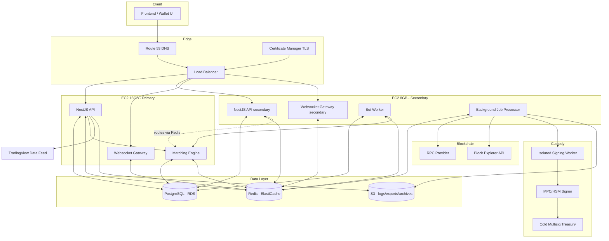
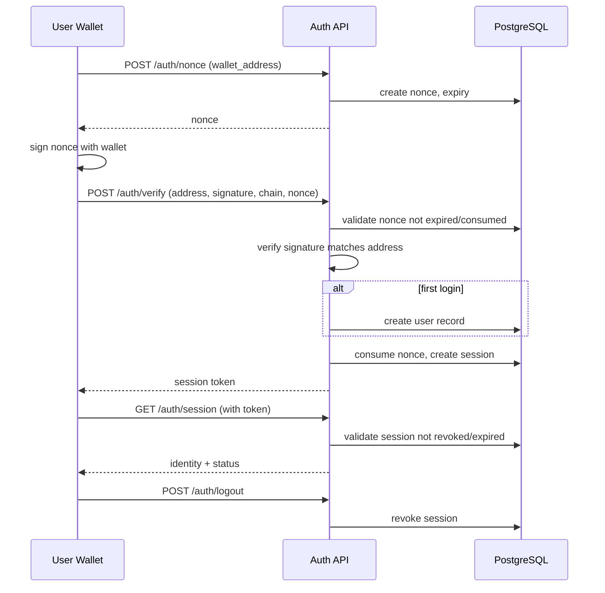
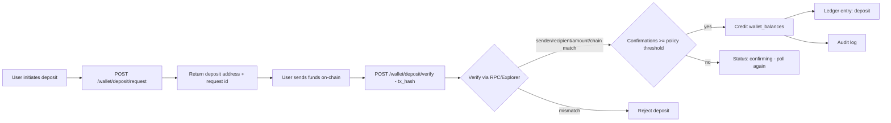
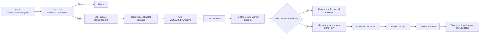
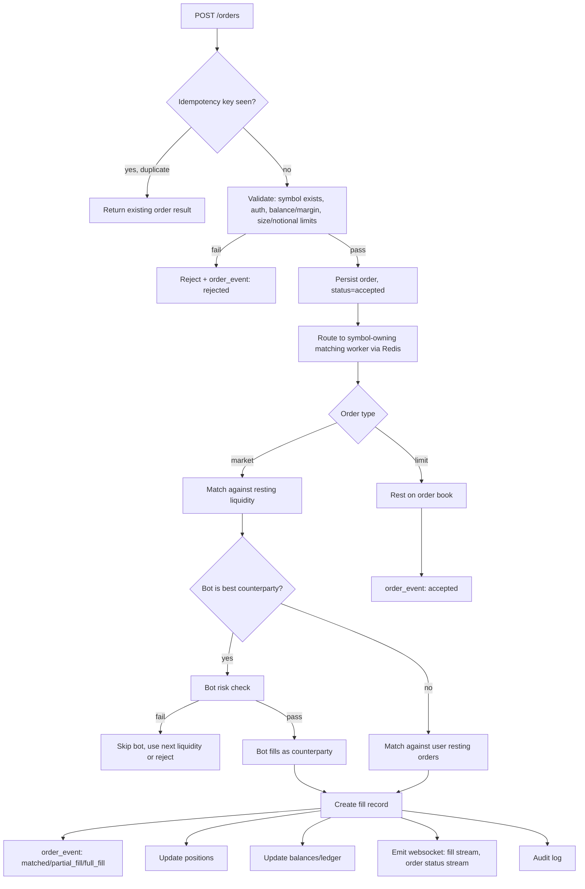
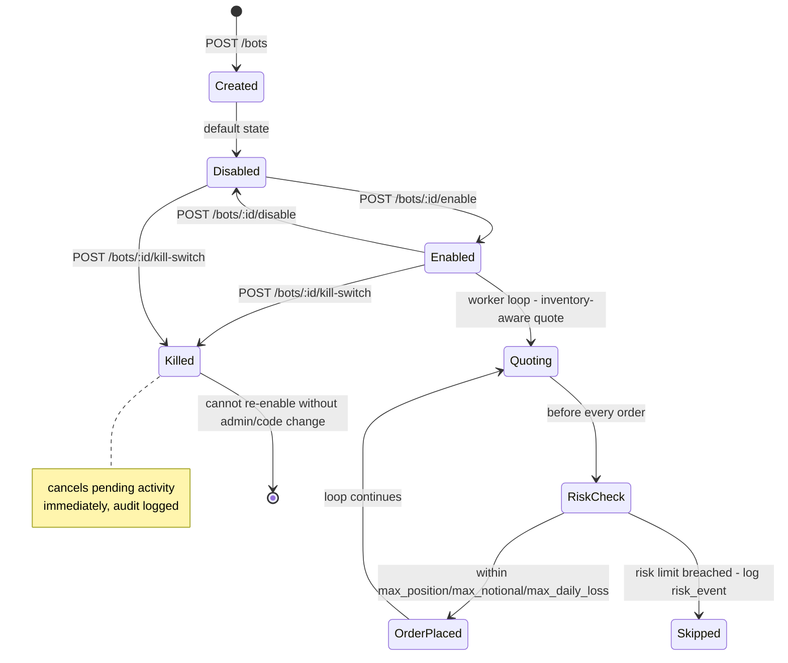
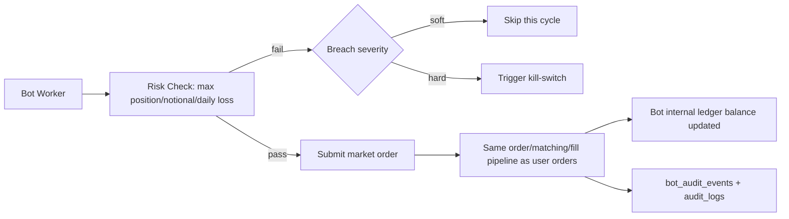
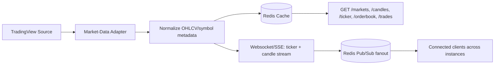
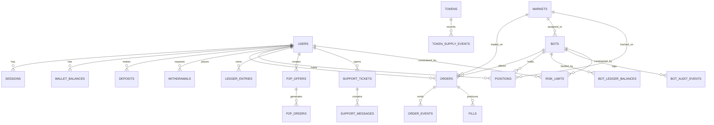
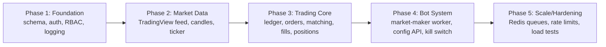

# DEX Backend — Architecture Diagrams

Mermaid diagrams for each major feature area, derived from `plan.md`, `api_requirements.md`, and `services.md`.

## 1. Overall System Architecture

## 2. Wallet Auth Flow (no email/password)

## 3. Deposit Verification Flow

## 4. Withdrawal Flow (custody-aware)

## 5. Order Entry + Matching Engine Flow

## 6. Market-Maker Bot Lifecycle

## 7. Bot Order Routing (shares pipeline with users)

## 8. Market Data / TradingView Integration

## 9. Data Model Relationship Overview

## 10. Delivery Phases (roadmap)

